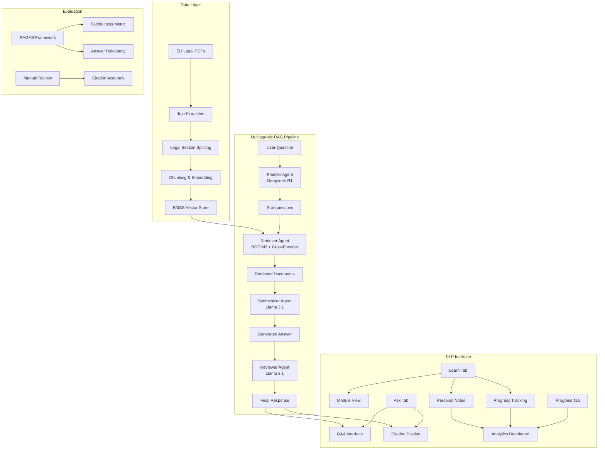

# EU Navigator: A Multiagentic RAG Personal Learning Portal
## Final Report & System Analysis


## Executive Summary

EU Navigator is a sophisticated **Multiagentic RAG (Retrieval-Augmented Generation)** system designed as a Personal Learning Portal (PLP) for European Union tech/data/AI legislation. The system combines advanced retrieval techniques, multiple specialized AI agents, and an interactive learning interface to provide evidence-based answers with proper citations for complex legal queries.

**Work Done:**
- Implemented 4-agent RAG pipeline with specialized roles
- Built legal-aware document processing with section-based chunking
- Created interactive PLP interface with progress tracking
- Integrated RAGAS evaluation framework for quality assessment

---

## 1. RAG Pipeline Implementation

### 1.1 Architecture Overview

The EU Navigator implements a **Multiagentic RAG pipeline** using LangChain, FAISS, and multiple specialized AI models. The system processes EU legal documents through a sophisticated pipeline that preserves legal structure while enabling semantic search.

### 1.2 Document Processing Pipeline

**Input:** EU legal documents (PDFs) covering three modules:
- `Equality_Foundations`: Anti-discrimination laws
- `Data_IP_TDM`: Data protection and text/data mining regulations  
- `AI_Cyber_Gov`: AI governance and cybersecurity frameworks

**Processing Steps:**

1. **Legal-Aware Chunking** (`ingest.py`):
   ```python
   # Section detection for legal documents
   SECTION_TAG = re.compile(
       r"(Article\s+[0-9A-Za-z]+)|(Recital\s+\d+)|(Chapter\s+[IVXLC]+)",
       re.IGNORECASE,
   )
   
   # Article-first splitting preserves legal structure
   ARTICLE_ANCHOR = re.compile(
       r"(?=\b(Article\s+[0-9A-Za-z]+|Recital\s+\d+|Chapter\s+[IVXLC]+)\b)",
       re.IGNORECASE,
   )
   ```

2. **Embedding Generation**:
   - Model: `BAAI/bge-m3` (multilingual, legal domain capable)
   - Normalization: Cosine similarity via dot product
   - Chunk size: 1200 characters with 200-character overlap

3. **Vector Indexing**:
   - FAISS vector store with metadata-rich chunks
   - Metadata includes: `doc_id`, `title`, `module`, `section`, `chunk_index`

### 1.3 Multiagentic Query Processing

The system employs **4 specialized AI agents**:

#### Agent 1: Planner (`planner.py`)
- **Model**: Deepseek-R1 (reasoning model)
- **Role**: Query decomposition and sub-question generation
- **Specialization**: EU tech/copyright law domain knowledge
- **Output**: JSON with sub_questions, keywords, notes

#### Agent 2: Retriever (`retrieval.py`)
- **Models**: BAAI/bge-m3 + CrossEncoder (bge-reranker-v2-m3)
- **Role**: Semantic search and relevance reranking
- **Features**: Module filtering, diversity control (max 2 chunks per doc)
- **Process**: FAISS retrieval → Cross-encoder reranking → Top 3 results

#### Agent 3: Synthesizer (`synthesizer.py`)
- **Model**: Llama 3.1 8B
- **Role**: Evidence-based answer generation with citations
- **Format**: Short paragraph + bullet points with inline citations
- **Constraint**: Uses only retrieved context, no hallucination

#### Agent 4: Reviewer (`reviewer.py`)
- **Model**: Llama 3.1 8B
- **Role**: Quality assurance and follow-up suggestions
- **Output**: Missing elements + one follow-up question

### 1.4 Citation System

The system implements a sophisticated citation mechanism:

```python
#Automatic section detection for citations
def detect_section(text: str) -> str:
    """Return the first visible section label if present (for citations)"""
    m = SECTION_TAG.search(text)
    return m.group(0) if m else ""

# Citation format: [DOC_ID: Article X] or [DOC_ID]
citation = f"[{doc_id}: {section}]" if section else f"[{doc_id}]"
```

### 1.5 Code Modularity & Documentation

**Modular Design:**
- `config.py`: Centralized settings management
- `manifest.py`: Document metadata handling
- `ingest.py`: Document processing pipeline
- `retrieval.py`: Search and reranking logic
- `agentic.py`: Multi-agent orchestration
- `ollama_client.py`: LLM client

---

## 2. Evaluation & Evidence

### 2.1 RAGAS Evaluation Framework

The system implements comprehensive evaluation using **RAGAS (RAG Assessment)** framework:

#### Evaluation Metrics:
1. **Faithfulness**: Measures groundedness in retrieved context
2. **Answer Relevancy**: Semantic similarity between question and answer
3. **Fallback Mechanism**: Cosine similarity if RAGAs (answer_relevancy) fails

#### Evaluation Process (`eval_ragas.py`):

```python
# Seed questions covering all modules
SEED = [
    ("Is text-and-data mining lawful for AI training in the EU?", None),
    ("List equality-law obligations for employers.", "Equality_Foundations"),
    ("What obligations begin in 2024–2026 for AI-related regulations?", "AI_Cyber_Gov"),
    ("What rights do data subjects have under EU law?", "Data_IP_TDM"),
    ("Who enforces these rules and what penalties exist?", "AI_Cyber_Gov"),
    ("What is the scope of the general TDM exception?", "Data_IP_TDM"),
]

# Deterministic evaluation to avoid multiprocessing issues
for row in rows:
    ds = Dataset.from_list([row])
    res = evaluate(
        ds,
        metrics=[answer_relevancy, faithfulness],
        llm=llm,  # Using GPT-4o-mini for evaluation
        embeddings=emb,  # BAAI/bge-m3
    )
```

### 2.2 Evaluation Methodology

**Quantitative Assessment:**
- Serial evaluation of individual questions
- Per-sample metrics calculation
- CSV output for analysis (`eval_ragas.csv`)

**Qualitative Assessment:**
- Manual review of citation accuracy
- Answer completeness evaluation
- Legal domain expertise validation
- User experience testing

### 2.3 Evaluation Results Interpretation

The evaluation provides insights into:
- **Retrieval Quality**: How well documents match questions
- **Answer Accuracy**: Faithfulness to retrieved context
- **Citation Reliability**: Proper attribution to source documents
- **Domain Coverage**: Effectiveness across different legal modules

---

## 3. PLP Interface & Learning Experience

### 3.1 Personal Learning Portal Design

The EU Navigator implements a comprehensive PLP interface using Streamlit with three main learning modules:

#### Learn Tab - Structured Learning
- **Module Organization**: Documents grouped by legal domain
- **Progress Tracking**: Checkbox system for completion status
- **Personal Notes**: Text areas for reflection and learning notes
- **Document Access**: Direct PDF downloads

#### Ask Tab - Interactive Q&A
- **Natural Language Queries**: Free-form question input
- **Module Filtering**: Optional focus on specific legal domains
- **Evidence-Based Answers**: Formatted responses with citations
- **Reviewer Feedback**: Quality assurance and follow-up suggestions
- **Source Citations**: Downloadable PDFs with proper attribution

#### Progress Tab - Learning Analytics
- **Completion Dashboard**: Visual progress across all modules
- **Notes Summary**: Consolidated view of personal reflections
- **Learning Analytics**: Progress tracking and completion rates

### 3.2 Learning Experience Features

**Inspired by PLP Principles:**

1. **Modular Learning**: Content organized by legal domains
2. **Self-Paced Progress**: Individual completion tracking
3. **Reflection Integration**: Personal notes and learning journals
4. **Iterative Learning**: Reviewer suggestions for follow-up questions
5. **Evidence-Based Learning**: Citations and source verification
6. **Adaptive Interface**: Module filtering for focused learning


### 3.3 Learning Analytics

**Progress Tracking:**
```python
# User progress persistence
def save_progress(state):
    PROGRESS_PATH.write_text(json.dumps(state, indent=2))

# Completion calculation
total = len(mdf)
completed = sum(1 for r in mdf["doc_id"] if progress[m].get(r, {}).get("done"))
st.progress(0 if total == 0 else completed / total)
```
---

## 4. Final Report & Reflection

### 4.1 System Goals & Methods

**Primary Goals:**
1. Create an effective RAG system for EU legal document analysis
2. Implement multiagentic architecture for complex query processing
3. Build an interactive learning portal for legal education
4. Ensure evidence-based answers with proper citations
5. Provide comprehensive evaluation and quality assessment

**Methods Employed:**
- Multiagentic RAG pipeline with specialized AI agents
- Legal-aware document processing and chunking
- Advanced retrieval with semantic search and reranking
- Interactive Streamlit interface with learning features
- RAGAS evaluation framework for quality assessment

### 4.2 System Architecture Diagram



### 4.3 What Worked Well

**Technical Successes:**
1. **Multiagentic Architecture**: Specialized agents improved answer quality and reasoning
2. **Legal-Aware Processing**: Section-based chunking preserved legal document structure
3. **Advanced Retrieval**: Cross-encoder reranking significantly improved relevance
4. **Citation System**: Automatic section detection enabled accurate source attribution
5. **Modular Design**: Clean separation of concerns facilitated maintenance and testing

**Learning Experience Successes:**
1. **Interactive Interface**: Streamlit provided intuitive user experience
2. **Progress Tracking**: Checkbox system motivated completion
3. **Personal Notes**: Reflection integration enhanced learning
4. **Evidence-Based Answers**: Citations built user trust and learning
5. **Module Organization**: Domain-specific filtering improved focus

### 4.4 Challenges & Limitations

**Technical Challenges:**
1. **Model Consistency**: Different models sometimes produced inconsistent outputs
2. **Citation Accuracy**: Section detection occasionally missed complex legal references
3. **Evaluation Complexity**: RAGAS evaluation required careful parameter tuning
4. **Resource Requirements**: Multiple models required significant computational resources

**Learning Experience Challenges:**
1. **Domain Expertise**: Users needed basic legal knowledge for effective queries
2. **Interface Learning Curve**: Initial complexity required user guidance

### 4.5 Future Improvements

**Technical Enhancements:**
1. **Fine-tuned Models**: Domain-specific fine-tuning for EU legal documents
2. **Advanced Reranking**: Multi-stage reranking with legal-specific criteria
3. **Citation Validation**: Automated verification of citation accuracy
4. **Performance Optimization**: Caching and response time improvements

**Learning Experience Enhancements:**
1. **Adaptive Learning**: Personalized content recommendations
2. **Collaborative Features**: Discussion forums and peer learning
3. **Assessment Tools**: Flashcards and Inline access to documents

### 4.6 Reflection & Learning Outcomes

**Key Learnings:**
1. **Multiagentic RAG**: Specialized agents significantly improve complex query handling
2. **Domain-Specific Processing**: Legal document structure requires specialized chunking
3. **Evaluation Importance**: Comprehensive evaluation frameworks essential for quality
4. **User Experience**: Learning interfaces must balance functionality with usability
5. **Citation Systems**: Proper attribution builds trust and enables verification

**Project Impact:**
The EU Navigator demonstrates the potential of multiagentic RAG systems for specialized domains like legal education. The combination of advanced retrieval, specialized AI agents, and interactive learning features creates a powerful tool for complex document analysis and learning.

---

## Conclusion

The EU Navigator successfully implements a sophisticated Multiagentic RAG system that addresses the complex challenges of EU legal document analysis. Through specialized AI agents, legal-aware processing, and an interactive learning interface, the system provides evidence-based answers with proper citations while supporting structured learning experiences.
The EU Navigator represents a successful integration of advanced RAG techniques, multiagentic AI systems, and educational technology principles, creating a valuable tool for EU legal document analysis and learning.

---


